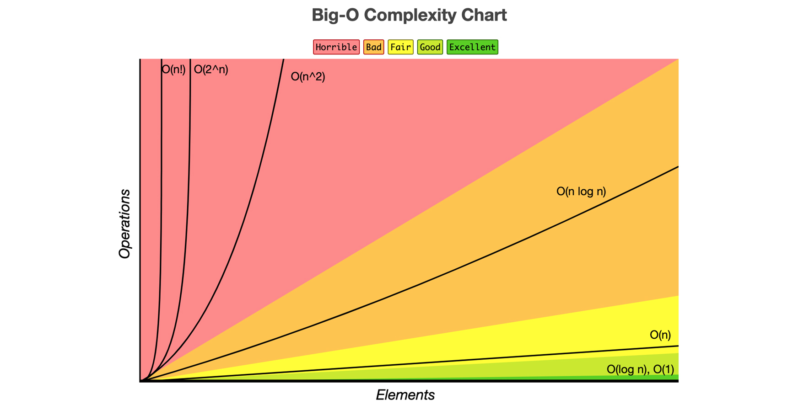
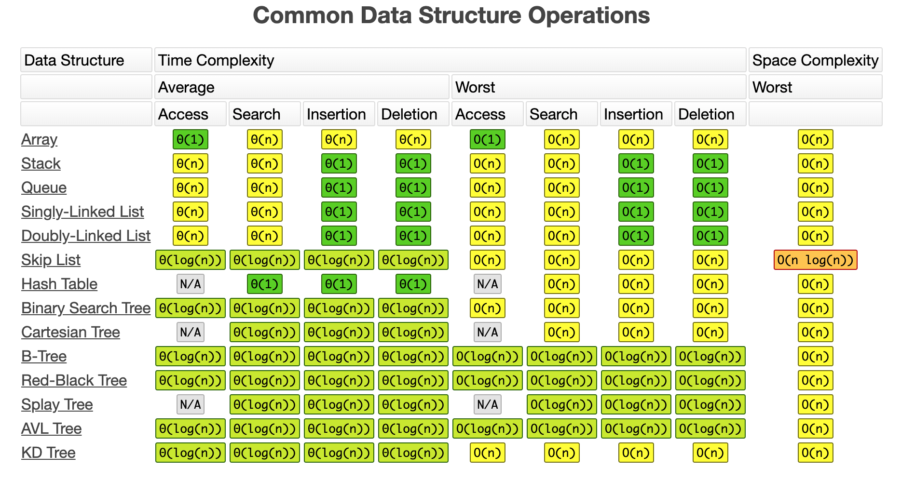
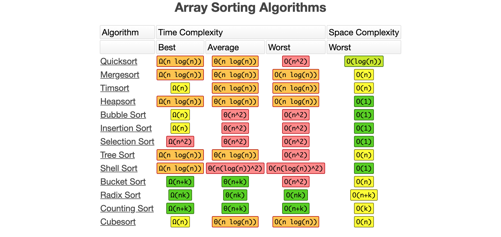

# Algorithms - Javascript
Data Structure and Algorithm practice

- __Logarithmic algorithm – O(logn):__ Runtime grows logarithmically in proportion to n.
- __Linear algorithm – O(n):__ Runtime grows directly in proportion to n.
- __Superlinear algorithm – O(nlogn):__ Runtime grows in proportion to n.
- __Polynomial algorithm – O(n^c):__ Runtime grows quicker than previous all based on n.
- __Exponential algorithm – O(c^n):__ Runtime grows even faster than polynomial algorithm based on n.
- __Factorial algorithm – O(n!):__ Runtime grows the fastest, becomes quickly unusable for even small values of n.

  
 